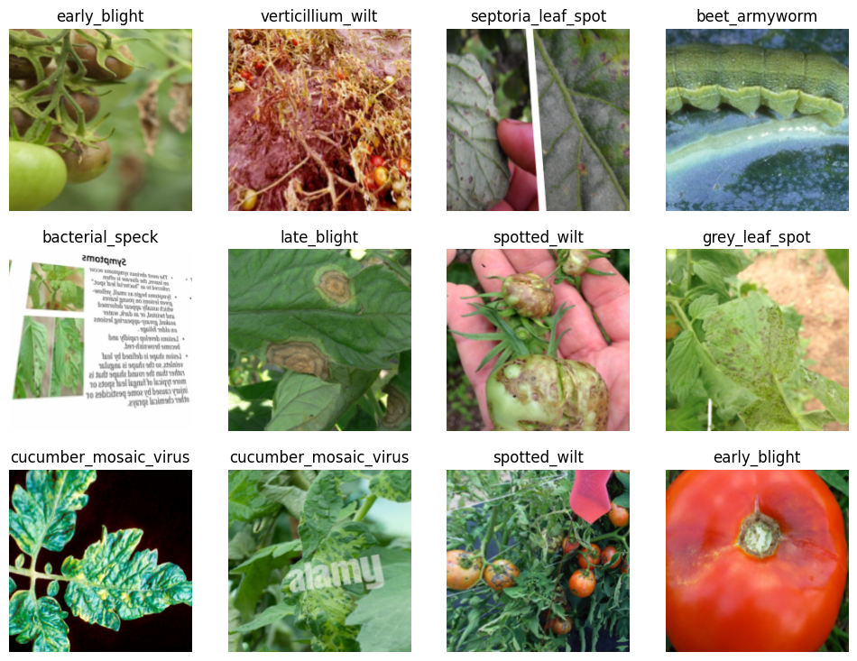
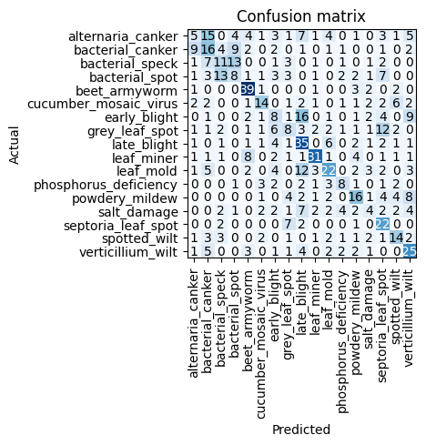
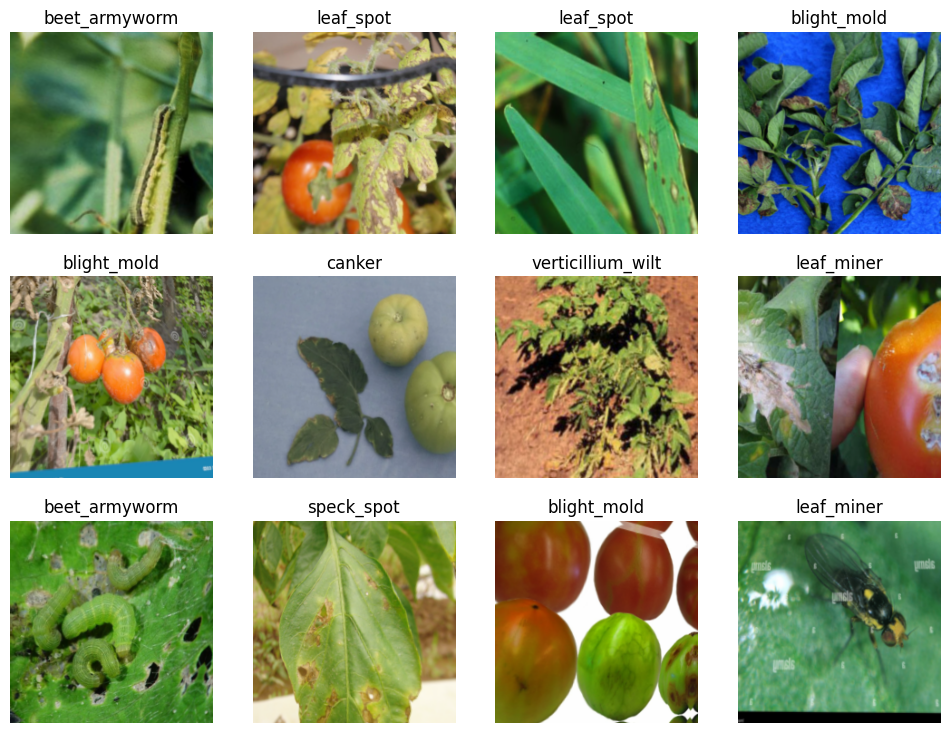
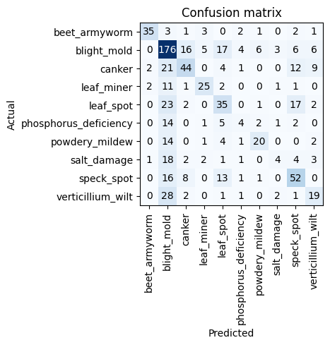

# tomato
How are your tomatoes?

I downloaded a bunch of pictures of tomato plants infected by various diseases (https://aggie-horticulture.tamu.edu/vegetable/problem-solvers/tomato-problem-solver/leaves/). The pictures are quit noisy. I had to clean them by hand and even after that step it certain classes are very hard to tell apart (as a non expert). Also the class labels are not verified by an expert - I simply crawled images:

An easy resnet model resultet in the following confusion matrix:

Certainly there is some mass on the main diagonal but there is also quit some missclassification - especially in classes that look very similar. Therefore I combined certain hard to tell apart classes into new *super classes* hoping that the missclassification decreases:

The confusion matrix is for certain classes more on the main diagonal - but the *super class* blight_mold is certainly to broad and not ideal yet.

Nevertheless the app is deployed on HuggingFace Space: 